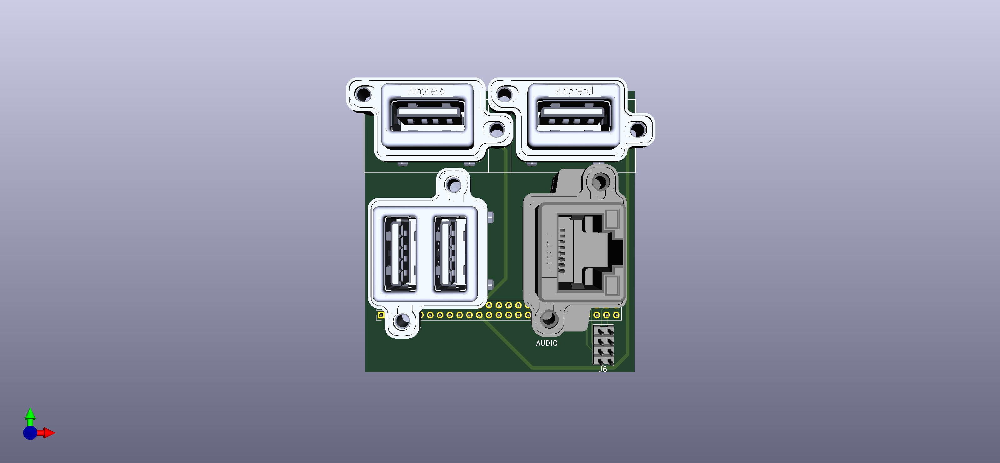
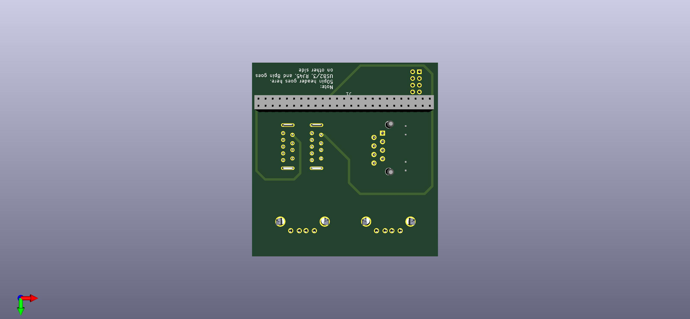
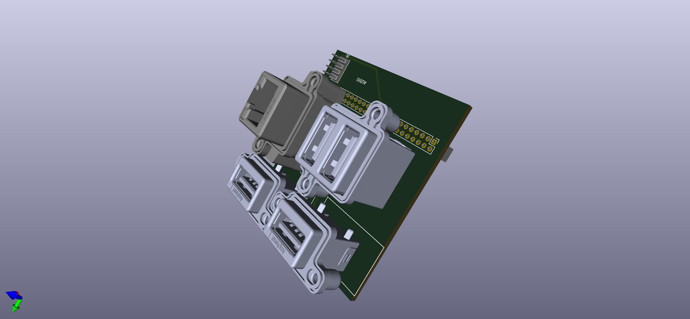
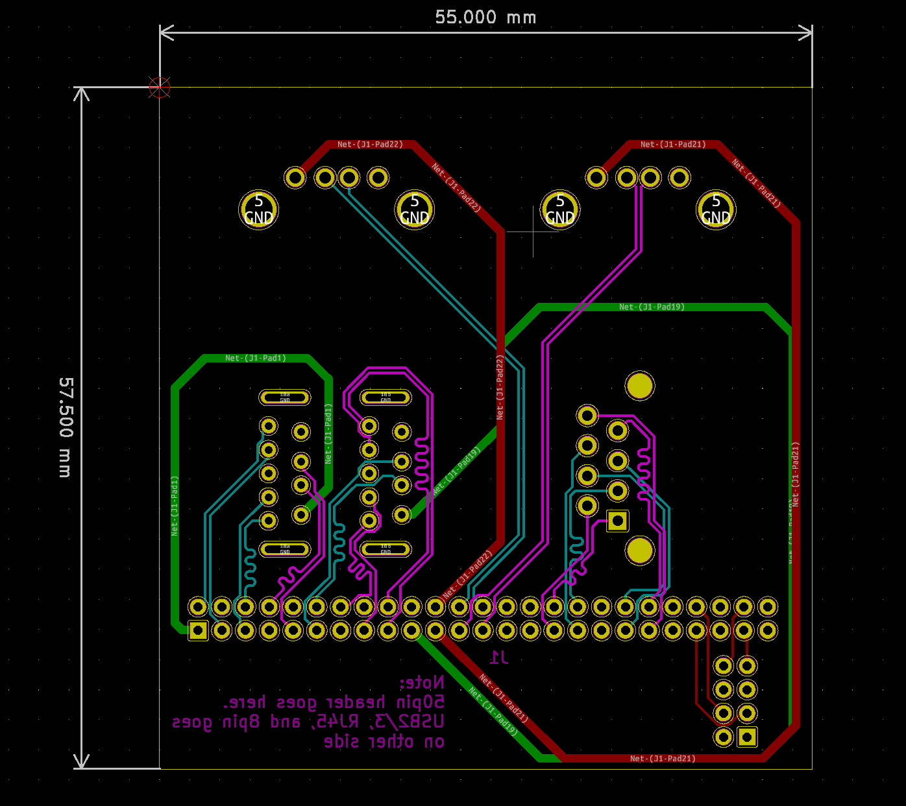

# Welcome to B-Wing Faceplate V1.0.0

The COM Express 10 specification is the smallest industrial board solution. There are ISO certified and perfect
for satellites, UAS, and automation where SWaP (size, weight, and power) are critical.

This KiCAD Package includes everything to connect to the B-Wing Riser and breaks out important ports (Cat6/GbE, USB2/3, audio) with IP67 Amphenol connectors. Essentially this will turn a COM Express 10 sandwich setup into a low-latency easy to package solution while allowing provisions for IP67 rating. All 3D models were matched to OEM libraries.

What you get (enough to manufacture and test)
* Gerber Files
* Drill files (inches and mm)
* Schematic
* Bill of Materials (BOM)
* Some pictures

To run and/or compile, you will need
* a B-Wing Riser board
* a Connectech CCG020
* Any COM 10 CPU Module (tested on Intel and AMD)
* A power source
* Any supported OS (boards will support booting from USB to start)

Here's what it looks like






## Changelog v1.0.0
```
  - initial release
```
## Known Issues
```
  - add KiCAD source (don't worry I hate it when people just give the gerbers)
  - add KiCAD footprints and 3d libraries for anything used
```

